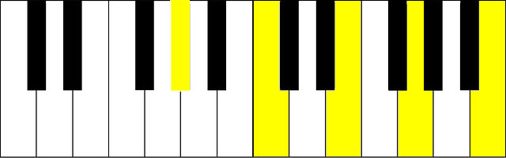
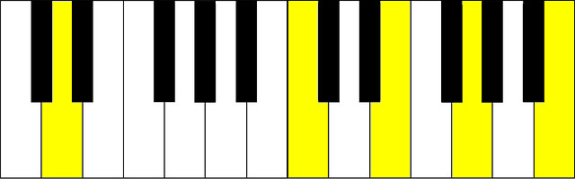
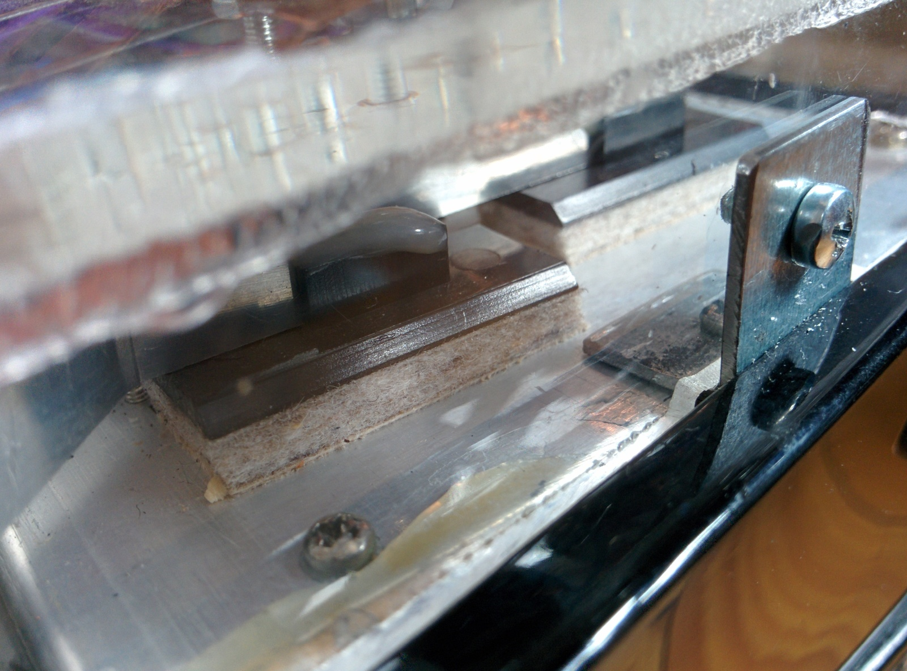

#MIDI-Accordion
How can I reuse an old instrument? Right, make it digital.

I had the wish to make digital music and wanted to reawake my small Hohner accordion because I used it seldom. So I started a small project to create a MIDI extension for the keyboard (right hand). After two months of working it's finally sending MIDI notes for each key, can play up to three octaves on one keypress and can interpret chords as commands.

##Technical
The extension is based on an Arduino Mega 2560 and programmed in C++, all the code can be found in the src/ Folder. The USB-port is used to get energy, but as the MIDI-Signals are sent with `Serial` the MIDI signals can be accessed over USB, too.

If someone has a question about a technical detail, feel free to open an issue or write a comment.

##Chords

Play everything one octave higher

Play everything one octave lower

Reset

<h2 style="float:left;clear:both;">Images</h2>

